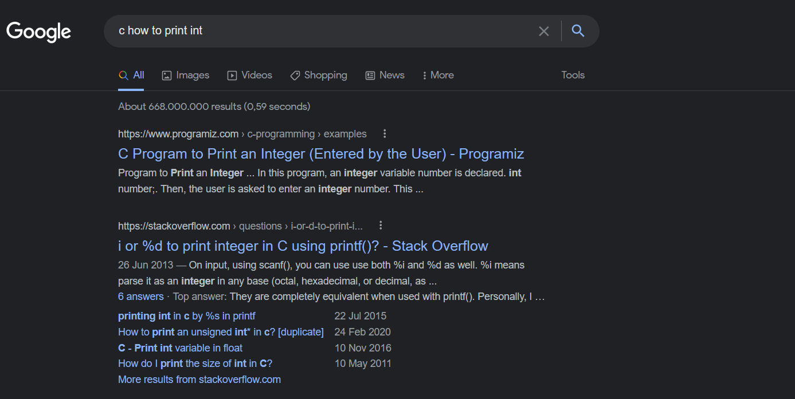

# Tutorium

C-Tutorium zum Software Kurs LRT-Bachelor der Universität Stuttgart

## Meine Praktomat Abgaben zum Selbsstudium
[Abgabe 1](https://github.com/BA-UniStuttgart/WS21_22_Softwarewerkzeuge_Praktomat_Abgabe01)
[Abgabe 2](https://github.com/BA-UniStuttgart/WS21_22_Softwarewerkzeuge_Praktomat_Abgabe02)
[Abgabe 3](https://github.com/BA-UniStuttgart/WS21_22_Softwarewerkzeuge_Praktomat_Abgabe03)


## Outline

1. Nützliche Resources
2. main funktion
3. primitive Datentypen & arrays & strings
4. printf, scanf
5. funktionen
6. control flow (if & switch)
7. Ops, BitOps, Modulo
8. loops (for & while)
9. define & typedef
10. structs
11. pointer
12. scope rules
13. heap mem
14. includes & library pattern
15. Praktomat aufgabe

## 1. Nützliche Resources
**Google ist dein Freund!**

Weitere Freunde:
[TutorialsPoint](https://www.tutorialspoint.com/cprogramming/index.htm) und [Stackoverflow](https://stackoverflow.com/)

Einfach wenn man nich weiter kommt sone dumme Suche machen: Stackoverflow und Tutorialspoint >>> alles andere eig.



## 2. Main Funktion'

Die Main Funktion ist die 1. Funktion die im Ganzen Programm ausgeführt wird. Aka. der "Entrypoint".

Eine Return value von **0** signalisiert erfolgreiches Abschließen.

Eine Return value von **1** signalisiert unerfolgreiches Abschließen.

```
#include <stdio.h>
#include <stdlib.h>

// EXIT_SUCCESS = 0
// EXIT_FAIL = 1

int main() {

    return 0;
}
```

## 3. primitive Datentypen & arrays & strings

## 4. printf, scanf

## 5. funktionen

## 6. control flow (if & switch)

## 7. Ops, BitOps, Modulo

## 8. loops (for & while)

## 9. define & typedef

## 10. structs